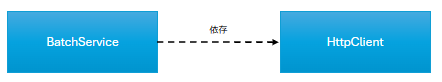
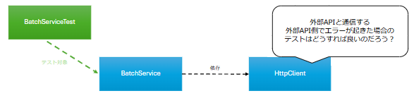
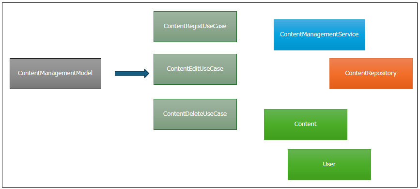

# リファクタに向けたテストコードの導入


<br>

---ほげほげ

<!-- _header: '' -->

## 話すこと

**テストコードってどんなもの？**
どんなことが出来るの？実際のコードはどんな感じ？

<br>

**テストコードを導入するモチベーションについて考える**
テストコードのメリット／デメリットは？

<br>

**テストコードを導入するために**
実際、どうやった？
既存のコードに対してテストコードを書くためにはどうすれば良い？

---

## 話さないこと

### 実装レベルのこと

- テストプロジェクトの作り方
- 実装レベルでのテストコードの書き方
  - テスト用ライブラリの使い方

---

## テストコードってどんなもの？

---

### テストコードとは

ある機能に対して、特定の入力値（IN）から得られる結果（OUT）を検証することを目的としたコード

- IN
  - パラメータ
  - ログインユーザーのセッション状態
  - DBの状態
- OUT
  - レスポンス
  - DBの状態

**機能単体を対象とするもの**であり、**必ずクラス単位で実装するというものではない**

---

### テストコードの例

```csharp
[TestClass]
public class UserPageModelTests
{
  [TestMethod("正常系: UserPageModelがユーザーの一覧情報を生成すること")]
  public void ResolveUsers()
  {
    // 実際のDBは使わず、テスト中のみ有効となるダミーのDBを生成する
    DbContext inMemoryDbContext = CreateInMemoryDbContext();
    inMemoryDbContext.user_table.add(new user_table { Id = 1, Name = '坂本 龍馬' });
    inMemoryDbContext.user_table.add(new user_table { Id = 2, Name = '西郷 隆盛' });

    // expected（期待値データの準備する）
    List<User> expected = new();
    expected.Add(new User { Id = 1, Name = '坂本 龍馬' });
    expected.Add(new User { Id = 2, Name = '西郷 隆盛' });

    // テスト対象の機能を実体化。ダミーのDBをDIする
    UserPageModel model = new UserPageModel(inMemoryDbContext);

    // actual（テスト対象のコードを実行して、実際に生成する結果値を取得する）
    List<User> actual = model.ResolveUsers();

    // expected（期待値） と actual（結果） が同一であることをテストする
    // expected: [{ Id = 1, Name = '坂本 龍馬' }, { Id = 2, Name = '西郷 隆盛' }]
    // actual:   [{ Id = 1, Name = '坂本 龍馬' }, { Id = 2, Name = '西郷 隆盛' }]
    Assert.AreEquals(expected, actual);   // success
  }

  private DbContext CreateInMemoryDbContext()
  {
    DbContextOptions options = new DbContextOptionsBuilder().UseInMemoryDatabase("database-name").Options;
    DbContext dbContext = new DbContext(options);
    return dbContext;
  }
}
```

---

### 失敗するテストの例

```csharp
[TestClass]
public class UserPageModelTests
{
  [TestMethod("正常系: UserPageModelがユーザーの一覧情報を生成すること")]
  public void ResolveUsers()
  {
    // 実際のDBは使わず、テスト中のみ有効となるダミーのDBを生成する
    DbContext inMemoryDbContext = CreateInMemoryDbContext();
    inMemoryDbContext.user_table.add(new user_table { Id = 1, Name = '坂本 龍馬', Han = '土佐' });
    inMemoryDbContext.user_table.add(new user_table { Id = 2, Name = '西郷 隆盛', Han = '薩摩' });

    // expected（期待値データの準備する）
    List<User> expected = new();
    expected.Add(new User { Id = 1, Name = '坂本 龍馬', Han = '土佐' });
    expected.Add(new User { Id = 2, Name = '西郷 隆盛', Han = '薩摩' });

    // テスト対象の機能を実体化。ダミーのDBをDIする
    UserPageModel model = new UserPageModel(inMemoryDbContext);

    // actual（テスト対象のコードを実行して、実際に生成する結果値を取得する）
    List<User> actual = model.ResolveUsers();

    // expected（期待値） と actual（結果） が同一であることをテストする
    // expected: [{ Id = 1, Name = '坂本 龍馬', Han = '土佐' }, { Id = 2, Name = '西郷 隆盛', Han = '薩摩' }]
    // actual:   [{ Id = 1, Name = '坂本 龍馬' }, { Id = 2, Name = '西郷 隆盛' }]
    Assert.AreEquals(expected, actual);   // failed
  }

  // User クラスに Han のプロパティが存在しないので、テストが通らない
  // 逆に言うと、 User に Han を設定する修正をおこなえば、テストが通る
}
```

---

### MSTestを導入することで出来るようになること

---

#### Visual Studioのテストエクスプローラーでテストケースの一覧化

Visual Studio上で単体テストの実施結果を一覧化できる。
各テストケースには任意の名前を付けられるので、そのまま単体テスト仕様書兼実施結果とも言える。


---

### テストレポートの生成（コードカバレッジ）

コードカバレッジ（テストコードが実行コードのどこを通ったか）をHTML形式で出力できる。


---

## テストコードを導入するモチベーションについて考える

---

"テストコードを書くこと"のモチベーションってなんだろう？
:thinking:

---

### テストコードの代表的な効果

- 品質の観点
  - パターンケースの網羅
  - リグレッションテストによるデグレード検知
  - 実施者への依存
- コスト軽減の観点
  - リグレッションテストの自動化

### それ以外にもこんな副次効果が…

- テストスイートがそのまま詳細設計としてのドキュメントになる
- テスタビリティの高い設計＝自然に高凝集+低結合の設計となる
  （責務が整理されており、デグレードが起こりづらい）

---

### テストコードを導入することで起こりうる問題（ネガティブ）

**イケてないテスト**が産み落とされる

- メンテナンスコストが大きい
- 観点が整理されておらず品質に貢献していない（≒粒度が詳細過ぎる）
- カバレッジを目的としたテストを書くと陥りやすい
- 過剰なテストでコスト対効果が薄くなってしまう点も注意

<br>

**→この状態に陥らないようテストコードに関する知識は必要！**

---

## テストコードを導入した話

---

### 外部APIを利用する新しいバッチ処理の開発で見えた問題



バッチが外部APIを利用する機能であり、特に異常系パターンの確認が困難だった

- 外部APIが返すレスポンスはこちらで制御できない
  デバッグ実行で変数を書き換えたり例外を投げたりするのか？
- テストケースも多く、且つ、手順も複雑
  - デバッグ実行はどういう手順でやるのか、テスト仕様書に全部書く
  - テストケースごとにデータベースの状態を毎回整理する

<br>

こんなの、仕様変更するたびに何度もテストしたくない！:thinking:

---

これ、テストコードで解決できるのでは？
:thinking::thinking::thinking::thinking:

---

### あれれ、なんかうまくいかないぞ？



- 外部APIとの接続ロジックのテストをするために、途中のロジックを通すための状態を準備しないといけない
  - コードの一部を修正すると、関係のない他のテストコードが共倒れし始める
- 異常系のテストはライブラリで無理やりモック化するしかない
  - テストがコードの中身を知ってしまうことになる＝一心同体でメンテしないといけない

---

なんだよ…あまりコスト効果無いじゃん……どうすればいいんだ……
:thinking::thinking::thinking::thinking::thinking::thinking::thinking::thinking::thinking::thinking::thinking::thinking::thinking:

---

### どうするといいんだろう？


- テストの時だけ外部APIに対するHTTP通信しないようにしたい
- バッチ処理のコアロジックとAPIを別々にテストしたい

<br>

**関心事によるクラスの分離**が必要
「ひとつのファイルに全部書く」という**これまでの考え方を変えよう**

---

### テストコードのためにクラス設計を見直す


---

### ロジックを小分けにしつつ、依存性の注入でクラスの結合度を下げる

```csharp
public class ApiClient
{

  private IHttpClient _httpClient;

  // コンストラクタ
  // コンストラクタに渡す IHttpClient によって振る舞いを変更する
  // =プロダクトコードとテストコードで実際に接続するかどうかを制御できる
  public class ApiClient(IHttpClient httpClient)
  {
    _httpClient = httpClient;
  }

  // 実際の処理
  // バッチ処理の中から、APIとの接続部分だけを抽出
  // ApiClientもインタフェース化すれば、バッチ処理側はApiClientのふるまいを考えなくてよい
  public ApiResult Connect()
  {
    HttpResponseMessage response = _httpClient.Get(HogeHoge);

    // 結果オブジェクトの生成ロジックを置き換えることなくテストできる
    ApiResult result = CreateApiResult(response);
    return result;
  }

}
```

---

### 良いテストをするためには良いクラス設計とテスト設計が必要

- ひとつのクラス（ファイル）から関心事を抽出し、別のクラスに切り出していく
- 「依存性の注入」を活用して、ロジックを抽象化する
- 小さな単位でテストを書く
- テストケースには抽象的な名前をつける
  - ○ APIが404エラーを返した場合に失敗を示すレスポンスを作る
  - × APIが404エラーを返した場合に例外を捕捉してハンドリング処理でレスポンスを作る

<br>

**そのためには、既存のアーキテクチャから飛び出す必要があるということ**

---

## テストコードはどうやって導入していくのか？

---

### 小さなクラスのテストとリファクタの進め方

1. ピンニングテスト（通しテスト）を書く
2. コードをリファクタする

---

### 大きなクラスのテストとリファクタの進め方

1. ピンニングテスト（通しテスト）は書けたら書く
   a. クラスが大きくなりすぎて苦痛ならやらない
2. 変更対象のコードに対するテストを書く
3. 仕様変更+リファクタする

<br>

仕様変更のタイミングで徐々にテストコードとリファクタをおこなう
最初からすべてのコードにテストコードを導入する必要はない

---

### 大きすぎるクラスを小さくする



---

### アーキテクチャは徐々に見直していく

- クリーンアーキテクチャで考えた場合の例を出しましたが、これが正解とは限らない
  - プロジェクトの特性ごとに開発しやすい構成は異なります
  - だんだんと開発しやすい構成が変わる可能性もあります
- モデルを小分けにすることはマストだと考えますが、どういった単位で分けるのが良いかはチームの皆さんで話し合うと良いです

<br>

**まずは実際に開発しているチームのみなさんで集まって「読みづらい、書きづらい、こうあってほしい」と思う箇所を挙げて話し合ってみると良いかも**

---

### 良いクラス設計、良いテストコードのイメージを育てるための手法

- ペアプログラミング
  - 2人1組でドライバーとナビゲーターに分かれ、2人で1つの機能を実装する
- モブプログラミング
  - ドライバーと2人以上のナビゲーターに分かれ、複数人で1つの機能を実装する
- バディプログラミング
  - 2人1組を作り、毎日1時間、その日書いたコードを相互レビューする

<br>

**みんなでコードについて会話したり、互いにフィードバックして気づきを得よう**

---

しつぎおうとう

---

## 参照

- [Microsoft Learn<br>「.NET Core と .NET Standard での単体テストのベスト プラクティス」](https://learn.microsoft.com/ja-jp/dotnet/core/testing/unit-testing-best-practices)
