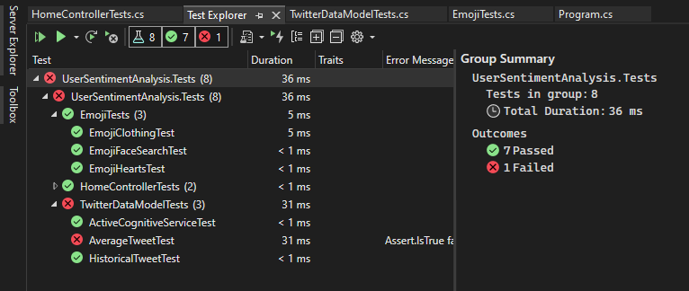
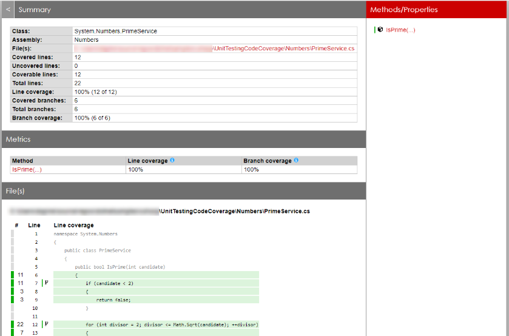
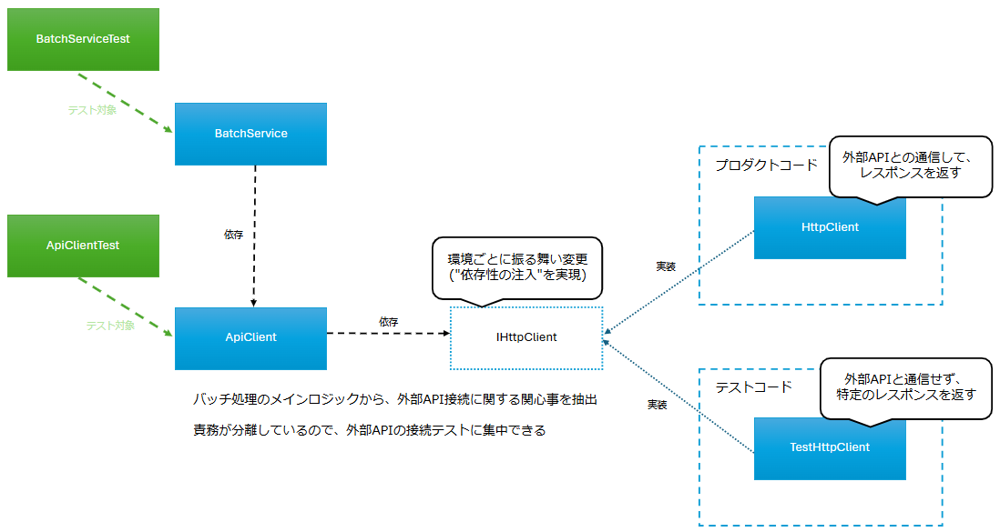

# リファクタに向けたテストコードの導入


<br>

---

<!-- _header: '' -->

## 話すこと

### テストコードってどんなもの？

- どんなことが出来るの？実際のコードはどんな感じ？

### テストコードを導入するモチベーションについて考える

- テストコードのメリット／デメリットは？

### テストコードを導入するために

- 結局、ぼくらのコードに対してテストコードを書くためにはどうしていけば良いのさ？
- これからのこと

---

## 話さないこと

### 実装レベルのこと

- テストプロジェクトの作り方
- 実装レベルでのテストコードの書き方
  - テスト用ライブラリの使い方

---

## テストコードってどんなもの？

---

### テストコードとは

ある機能に対して、特定の入力値（IN）から得られる結果（OUT）を検証することを目的としたコード

- IN
  - パラメータ
  - ログインユーザーのセッション状態
  - DBの状態
- OUT
  - レスポンス
  - DBの状態

**機能単体を対象とするもの**であり、**必ずクラス単位で実装するというものではない**

---

### テストコードの例

```csharp
[TestClass]
public class UserPageModelTests
{
  [TestMethod("正常系: UserPageModelがユーザーの一覧情報を生成すること")]
  public void ResolveUsers()
  {
    // 実際のDBは使わず、テスト中のみ有効となるダミーのDBを生成する
    DbContext inMemoryDbContext = CreateInMemoryDbContext();
    inMemoryDbContext.user_table.add(new user_table { Id = 1, Name = '坂本 龍馬' });
    inMemoryDbContext.user_table.add(new user_table { Id = 2, Name = '西郷 隆盛' });

    // expected（期待値データの準備する）
    List<User> expected = new();
    expected.Add(new User { Id = 1, Name = '坂本 龍馬' });
    expected.Add(new User { Id = 2, Name = '西郷 隆盛' });

    // テスト対象の機能を実体化。ダミーのDBをDIする
    UserPageModel model = new UserPageModel(inMemoryDbContext);

    // actual（テスト対象のコードを実行して、実際に生成する結果値を取得する）
    List<User> actual = model.ResolveUsers();

    // expected（期待値） と actual（結果） が同一であることをテストする
    // expected: [{ Id = 1, Name = '坂本 龍馬' }, { Id = 2, Name = '西郷 隆盛' }]
    // actual:   [{ Id = 1, Name = '坂本 龍馬' }, { Id = 2, Name = '西郷 隆盛' }]
    Assert.AreEquals(expected, actual);   // success
  }

  private DbContext CreateInMemoryDbContext()
  {
    DbContextOptions options = new DbContextOptionsBuilder().UseInMemoryDatabase("database-name").Options;
    DbContext dbContext = new DbContext(options);
    return dbContext;
  }
}
```

---

### 失敗するテストの例

```csharp
[TestClass]
public class UserPageModelTests
{
  [TestMethod("正常系: UserPageModelがユーザーの一覧情報を生成すること")]
  public void ResolveUsers()
  {
    // 実際のDBは使わず、テスト中のみ有効となるダミーのDBを生成する
    DbContext inMemoryDbContext = CreateInMemoryDbContext();
    inMemoryDbContext.user_table.add(new user_table { Id = 1, Name = '坂本 龍馬', Han = '土佐' });
    inMemoryDbContext.user_table.add(new user_table { Id = 2, Name = '西郷 隆盛', Han = '薩摩' });

    // expected（期待値データの準備する）
    List<User> expected = new();
    expected.Add(new User { Id = 1, Name = '坂本 龍馬', Han = '土佐' });
    expected.Add(new User { Id = 2, Name = '西郷 隆盛', Han = '薩摩' });

    // テスト対象の機能を実体化。ダミーのDBをDIする
    UserPageModel model = new UserPageModel(inMemoryDbContext);

    // actual（テスト対象のコードを実行して、実際に生成する結果値を取得する）
    List<User> actual = model.ResolveUsers();

    // expected（期待値） と actual（結果） が同一であることをテストする
    // expected: [{ Id = 1, Name = '坂本 龍馬', Han = '土佐' }, { Id = 2, Name = '西郷 隆盛', Han = '薩摩' }]
    // actual:   [{ Id = 1, Name = '坂本 龍馬' }, { Id = 2, Name = '西郷 隆盛' }]
    Assert.AreEquals(expected, actual);   // failed
  }

  // User クラスに Han のプロパティが存在しないので、テストが通らない
  // 逆に言うと、 User に Han を設定する修正をおこなえば、テストが通る
}
```

---

### MSTestを導入することで出来るようになること

---

#### Visual Studioのテストエクスプローラーでテストケースの一覧化

Visual Studio上で単体テストの実施結果を一覧化できる。
各テストケースには任意の名前を付けられるので、そのまま単体テスト仕様書兼実施結果とも言える。



---

### テストレポートの生成（コードカバレッジ）

コードカバレッジ（テストコードが実行コードのどこを通ったか）をHTML形式で出力できる。



---

## 実際にやったこと

---

### テストコードのモチベーション

ある日、外部APIを利用する新しいバッチ処理を設計～実装する真っ只中であった。
開発を進めていくうちに、以下の問題が見えてきた。

- 新しいバッチは外部APIを利用する機能であり、異常系パターンの確認が困難
  - かといって、やらないわけにはいかない。
    1ケースずつデバッグ実行して、変数を書き換えて確認するしかない…？
- テストケースが多く、且つ、テストの手順も複雑
  - テスト工数がかかりすぎる
  - 今後、仕様変更の度に何度もテストするのか…？

これ、テストコードで解決できるのでは？:thinking:

---

### テストコードを実装した

- 外部APIに対するHTTP通信をモック化することで正常系・異常系のパターンテストを実現
- テストコードを導入するにあたり、既存のアーキテクチャ（namespaceの構造）から飛び出す
  - 現行のアーキテクチャに従うと、1ファイルにほぼすべての処理を書かなければならない
  - 足枷になっていたこれまでのアーキテクチャから飛び出す

---

### テストコードのためにクラス設計を整理



---

## テストコードを導入するモチベーションについて考える

---

### "テストコードを書くこと"のモチベーションってなんだろう？

- 単体テストが自動化出来れば工数を削減できる？
- テストの実施が難しい機能のテストが簡単になる？
- カバレッジ100%ができる？

---

### テストコードの代表的な効果

- 品質の観点
  - パターンケースの網羅
  - リグレッションテストによるデグレード検知
- テスト効率の観点
  - リグレッションテストはテストコードをrun（実行）するだけ
    - 冪等性の担保が容易

### それ以外にもこんな副次効果が…

- テストコードのために、テスト容易性の高い設計を考える文化が出来る
  → 責務の整理された（結合度の低い）クラス設計ができる
- テストケースとして、正常系・異常系のパターンケースを実施する
  → テストコードがそのまま詳細設計レベルのドキュメントになる

---

### テストコードを導入することで起こりうる問題（ネガティブ）

- 当然、プロダクトコードと別にメンテナンスコストが発生する
  - "イケてない"テストコードはメンテ地獄を呼び起こしてしまう
    → とてもよくある話。この後もう少し深掘りします
- やっぱり学習コストはかかる
  - テストコードの書き方（ライブラリ）を習得する必要がある
  - テストコードに対する考え方も身につけた方が良い

**…逆に言うと、これらの問題をクリア出来るなら導入しない選択肢は無い！**

---

## テストコードを導入するために

---

### "良いテストコード"とは？

以下の条件を満たしていること

- メンテナンス性に優れている
- デグレードを検知してくれる
- テストコード自体がドキュメントになっている

---

### 良いテストコードを書くために必要な知識

- 依存性の注入
- ***

### テストを導入するにあたって考えること

- テストしやすいコード＝良いコードというマインドを持つ
- 勘違いされがちだが、コードを流すことがテストコードではない
  - INとOUTのレベルでテストコードであること
  - カバレッジは絶対ではない。カバレッジ100%という数字にどれだけ意味があるのか？
- 実施するテストは絞る

---

## 実際のところ、テストコードを導入していくためにはどうしたらいいんだろう？

- ピンニングテストとして書きたいけど、今のコードにそのまま適用することは困難

---

### あ

---

### テスト実装のための最初の一歩

- ペアプログラミング
- バディプログラミング
- 大きなModelクラスの機能を抽象化し、概念を抽出する
  - 良いクラス設計や依存性の注入をおこなう上で重要

---

## さらなるその先へ

|                                               | 名称                     | 内容           |
| --------------------------------------------- | ------------------------ | -------------- |
|  | レガシーコードからの脱却 | テスト駆動開発 |

---

## 参照

- [Microsoft Learn<br>「.NET Core と .NET Standard での単体テストのベスト プラクティス」](https://learn.microsoft.com/ja-jp/dotnet/core/testing/unit-testing-best-practices)

---

おわり
